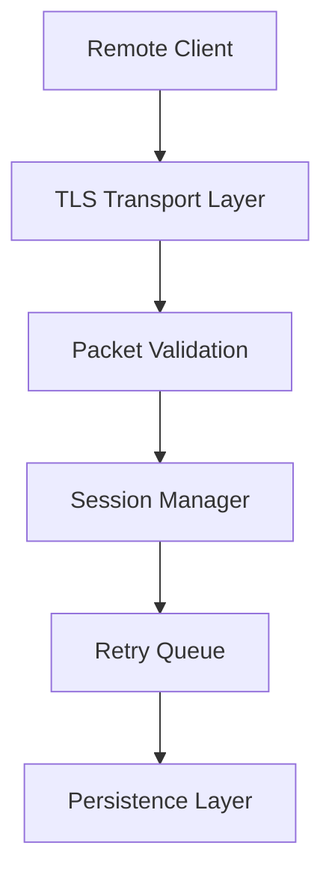

# Secure Async Control Framework

Secure Async Control Framework is a research-oriented project focused on designing secure asynchronous communication systems using Python. The repository demonstrates concepts related to transport security, distributed communication, session management, packet validation, and resilient network architecture.

The purpose of this project is not offensive operations or unauthorized access. It was built to explore secure protocol engineering and asynchronous service design in controlled and educational environments.

---

## Overview

This framework implements a modular asynchronous communication architecture with support for:

* secure TLS transport
* packet sequencing
* replay protection
* heartbeat monitoring
* persistent task handling
* session lifecycle management
* connection resilience
* rate limiting

The project is structured to resemble a real-world engineering repository rather than a single-file proof of concept.

---

## Architecture



---

## Core Features

### Asynchronous Networking

The framework is built on top of Python `asyncio` to support concurrent client sessions efficiently without relying on traditional thread-per-client models.

### Secure Communication Layer

TLS is used to establish encrypted transport channels between server and client components. This helps ensure:

* encrypted communication
* secure session establishment
* transport integrity
* authenticated connections

### Packet Validation

Each packet includes metadata used for validation:

* packet identifiers
* timestamps
* sequence numbers
* nonces

These mechanisms help reduce the risk of replay attacks and malformed packet handling.

### Session Management

The server maintains session state information including:

* active connections
* heartbeat tracking
* timeout detection
* reconnect handling
* session cleanup

### Persistent Task Queue

Task persistence allows the framework to recover pending operations and retry interrupted tasks after temporary failures or disconnects.

---

## Repository Structure

```text
secure-async-control-framework/
│
├── client/
├── server/
├── shared/
├── tests/
├── docs/
├── certs/
├── logs/
│
├── main.py
├── requirements.txt
├── README.md
└── LICENSE
```

---

## Components

### Server Layer

The server component is responsible for:

* accepting secure connections
* processing packets
* managing sessions
* dispatching tasks
* handling retry queues

### Client Layer

The client side handles:

* secure transport communication
* heartbeat transmission
* packet acknowledgements
* reconnect persistence

### Shared Layer

Shared modules provide:

* protocol definitions
* validators
* utility functions
* shared constants
* cryptographic helpers

---

## Security Design

The framework includes multiple defensive mechanisms commonly used in secure communication systems.

| Mechanism            | Purpose                        |
| -------------------- | ------------------------------ |
| TLS Transport        | Secure encrypted communication |
| Packet Sequencing    | Packet order validation        |
| Nonce Validation     | Replay mitigation              |
| Timestamp Validation | Expired packet detection       |
| Rate Limiting        | Flood protection               |
| Heartbeat Monitoring | Session validation             |

---

## Technologies

| Technology   | Purpose              |
| ------------ | -------------------- |
| Python 3.12  | Core language        |
| asyncio      | Asynchronous runtime |
| aiosqlite    | Persistence layer    |
| cryptography | Encryption utilities |
| TLS/SSL      | Secure transport     |

---

## Educational Goals

This repository was developed to explore:

* secure protocol engineering
* asynchronous distributed systems
* resilient network architecture
* session-oriented communication
* transport-layer security
* fault-tolerant service design

---

## Testing

The project includes test modules for validating:

* packet handling
* replay protection
* sequence verification
* transport reliability
* session logic

Run tests using:

```bash
pytest
```

---

## Installation

Clone the repository:

```bash
git clone https://github.com/phllonq/secure-async-control-framework.git
```

Install dependencies:

```bash
pip install -r requirements.txt
```

---

## Running

Start the server:

```bash
python main.py
```

---

## Future Improvements

Potential future enhancements include:

* protobuf serialization
* structured logging
* metrics collection
* websocket transport
* distributed queue backend
* packet compression
* advanced retry policies

---

## Disclaimer

This repository was created strictly for:

* cybersecurity education
* protocol research
* defensive simulations
* authorized environments

Unauthorized or unethical usage is prohibited.
